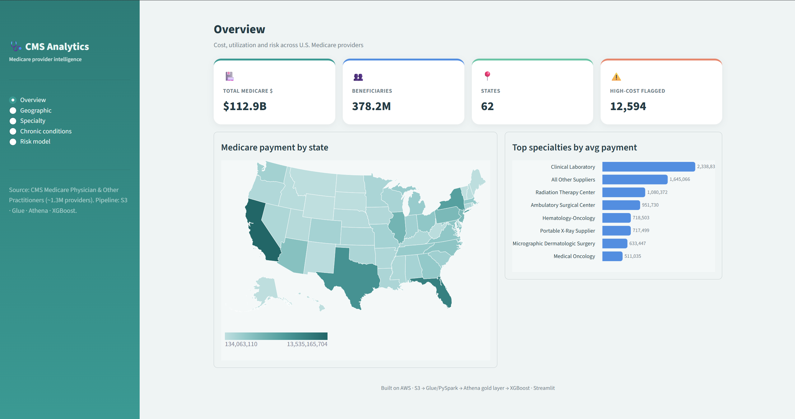

# 🩺 CMS Medicare Provider Analytics Pipeline

An end-to-end **AWS data engineering + machine learning** project on **real
CMS Medicare data**: a serverless pipeline that ingests ~1.3M provider
records, cleans and quality-checks them, models an analytics-ready gold
layer, trains an XGBoost model to flag high-cost providers, and serves it all
through an interactive healthcare dashboard.

> **Scope note (honest by design):** the source is **provider-level summary
> data**, not individual claims. No Redshift, Airflow, or dbt are used — the
> stack is deliberately serverless and cost-minimal (Athena over Parquet).

---

## ✨ Why this project is worth a look

- **Real, messy, public healthcare data** — 1.26M rows, 81 raw columns.
- **A complete pipeline**, not a notebook: ingestion → ETL → **data quality**
  → catalog → **gold analytics layer** → **ML** → **dashboard**.
- **Event-driven & serverless** — an upload triggers the whole thing.
- **Cost-disciplined** — Athena/Spectrum instead of an always-on warehouse;
  ML on an ephemeral, spot-eligible SageMaker job with local scoring.
- **Production hygiene** — Glue Data Quality rules, target-leakage control in
  the model, idempotent writes, least-privilege IAM, config in one place.

---

## 🏗️ Architecture

```
                       ┌──── S3 upload (raw/*.csv) ────┐
                       ▼                                │
        cms-file-validator (Lambda)  ── validates ──────┘
                       │ starts
                       ▼
        Step Functions state machine
                       │
                       ▼
        Glue / PySpark ETL  ──►  S3 processed/ (Parquet, partitioned by state)
          • select + clean columns          + Glue Data Quality (13 rules)
          • flag high-cost outliers          │
                       │                      ▼
                       │                 SNS alerts (success / failure)
                       ▼
        Glue Data Catalog  ──►  Athena gold layer (star schema + marts)
                                        │                 │
                          ┌─────────────┘                 └──────────────┐
                          ▼                                              ▼
              SageMaker XGBoost                            Streamlit dashboard
        (high-cost risk + feature importance)          (US map, KPIs, risk model)
```

---

## 📊 Dataset

**CMS Medicare Physician & Other Practitioners — by Provider (2023).**
Public, provider-level summary of Medicare fee-for-service utilization and
payments.

- **Rows:** 1,259,343 (one per provider) · **Raw columns:** 81
- **Source:** [data.cms.gov](https://data.cms.gov/provider-summary-by-type-of-service/medicare-physician-other-practitioners/medicare-physician-other-practitioners-by-provider)
- **Fields used:** NPI, provider name, specialty/type, state, total Medicare
  payment / submitted charge / allowed amount, beneficiary & service counts,
  and chronic-condition prevalence (% of a provider's panel with diabetes,
  hypertension, heart failure, CKD).

Data files are **not** committed (see `.gitignore`); the pipeline regenerates
them. A small snapshot for the dashboard lives in `dashboard/data/`.

---

## 🧰 Tech stack & modules

**AWS:** S3 · Glue (PySpark) · **Glue Data Quality** · Glue Data Catalog ·
Athena · Lambda · Step Functions · SNS · SageMaker · IAM

**Python** (`requirements.txt`):

| Module | Why |
|--------|-----|
| `boto3` | all AWS calls (deploys, training, S3) |
| `awswrangler` | Athena → pandas queries |
| `pandas`, `pyarrow` | data wrangling / Parquet |
| `scikit-learn` | train/validation split, metrics |
| `xgboost` (`<3`) | load & score the trained model locally |
| `matplotlib` | feature-importance plotting |
| `streamlit`, `altair` | the dashboard + charts |

> No `sagemaker` SDK — training is launched through **boto3** (stable across
> SDK versions) using SageMaker's built-in XGBoost algorithm.

---

## 📁 Repository layout

| Path | What it does |
|------|--------------|
| `config/` | `settings.py` (all resource names) + `aws_session.py` (central, secret-free boto3 access) |
| `glue_jobs/cms_transform.py` | PySpark ETL: clean, flag outliers, **Glue Data Quality**, write partitioned Parquet |
| `glue_jobs/deploy_and_run.py` | deploy the ETL script to the Glue job and run it — from your editor |
| `lambda_functions/` | S3-triggered validator that starts the state machine |
| `step_functions/` | state-machine definition (Glue → SNS) |
| `orchestration/deploy_orchestration.py` | wires Lambda → Step Functions |
| `athena/gold/*.sql`, `athena/deploy_views.py` | star-schema views + gold marts |
| `ml/` | `prepare_features` → `train_xgboost` (SageMaker) → `score` → `publish_predictions` |
| `dashboard/` | `export_gold_results`, `build_dashboard_data`, Streamlit `app.py` |
| `notebooks/` | exploratory EDA / cleaning |

---

## 🔬 Highlights

**Data quality (warn-only, in-pipeline).** 13 DQDL rules run inside the Glue
job every load. Baseline: **1,259,343 rows**, NPI **100% complete & unique**,
state codes valid, payments non-negative.

**Storage optimization.** Partition-aware repartitioning cut the processed
layer from **2,887 files / 321 MB → 62 files / 47 MB**, speeding up (and
cheapening) every downstream Athena scan.

**ML — high-cost provider risk.** XGBoost classifier on a **~1% positive
class**, with **target leakage controlled** (all payment/charge columns
dropped, since the label is derived from payment). Top risk drivers are
**specialty** (e.g. Ambulatory Surgical Centers) and **service volume** —
clinically sensible, not leakage.

---

## 🖥️ Dashboard

An executive, patient-oriented BI view: sidebar navigation, KPI cards, a **US
choropleth** of Medicare spend, chronic-condition maps, and the ML risk model
(donut + feature importance + top-risk providers).

<!-- Add a screenshot at docs/dashboard.png to show it off here -->


*Live demo:* deploy free on [Streamlit Community Cloud](https://share.streamlit.io)
(main file `dashboard/app.py`) — it reads the committed `dashboard/data/`
snapshot, so no AWS credentials are needed to view it.

---

## 🚀 Run it yourself

```bash
python -m venv .venv && . .venv/Scripts/activate     # Windows
pip install -r requirements.txt
python -m config.aws_session                          # verify AWS access
```

```bash
# 1. ETL + data quality  (deploy the Glue script and run it)
python -m glue_jobs.deploy_and_run
# 2. Orchestration        (Lambda -> Step Functions)
python -m orchestration.deploy_orchestration
# 3. Gold layer           (Athena views — free)
python -m athena.deploy_views
# 4. ML                   (train_xgboost is billable — SageMaker)
python -m ml.prepare_features
python -m ml.train_xgboost
python -m ml.score
# 5. Dashboard
python -m dashboard.export_gold_results
python -m dashboard.build_dashboard_data
python -m streamlit run dashboard/app.py
```

---

## 💰 Cost notes

Athena is pay-per-scan (fractions of a cent here). The SageMaker training job
is a small, time-capped, spot-eligible instance (cents); scoring runs locally
with **no** hosted endpoint. Everything else (S3, Glue, Lambda, Step
Functions, SNS) is negligible pay-per-use at this scale.

---

## 🎯 Status

AWS Certified Data Engineer (DEA-C01) portfolio project.
✅ ETL · ✅ Glue Data Quality · ✅ Athena gold layer · ✅ Orchestration ·
✅ XGBoost risk model · ✅ Streamlit dashboard
